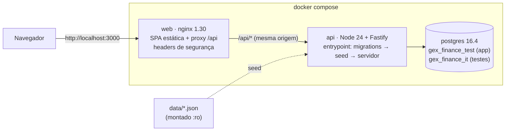
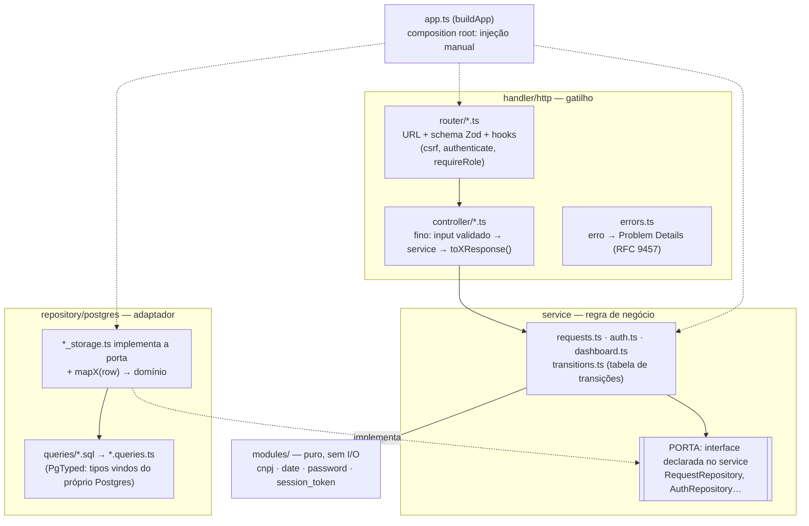
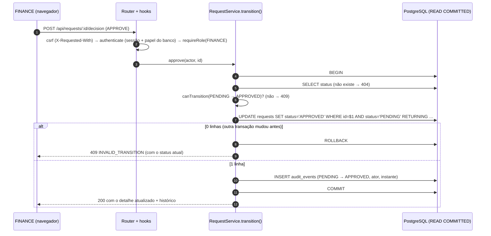
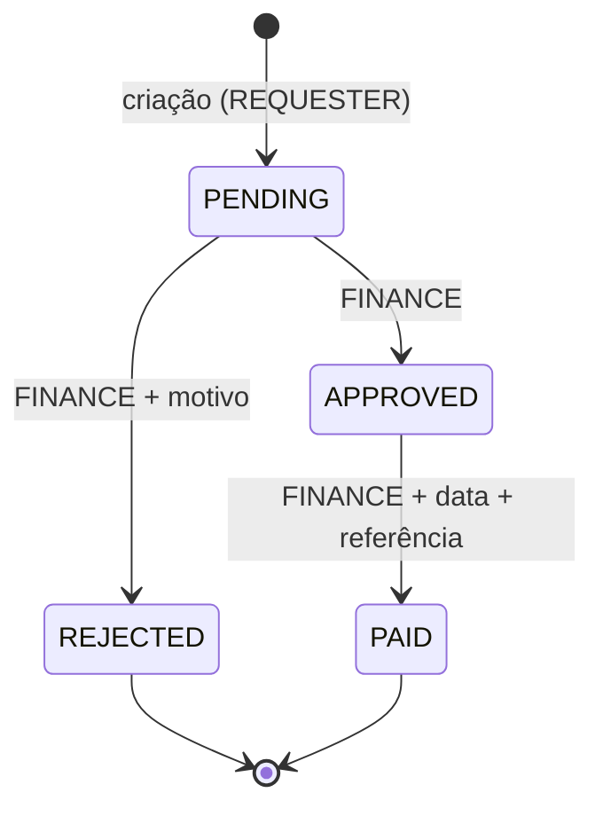
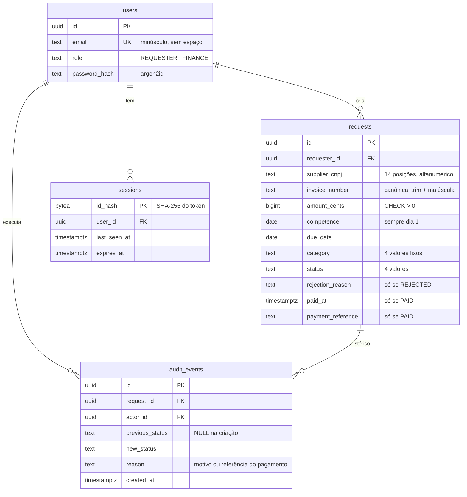
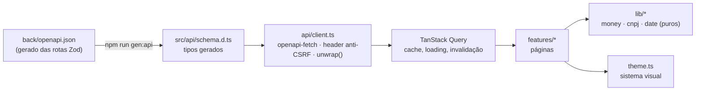

# Arquitetura

Como o sistema é montado e por quê. As decisões detalhadas, com fontes, estão em
[`docs/decisoes/`](docs/decisoes/) (referenciadas aqui como §N).

As escolhas seguem o enunciado, que pede *"uma solução pequena, correta e fácil de entender"*. O escopo é 1 gatilho
(HTTP), 3 entidades (usuário, solicitação, evento de auditoria) e 1 banco, e cada padrão só entra se resolve um problema
que esse escopo tem (§16).

## 1. Visão geral

- O nginx serve o front e repassa `/api` para a API. Como tudo fica na mesma origem, o cookie de sessão
  `SameSite=Strict` funciona sem CORS (§8.3).
- O entrypoint da API aplica as migrations (dbmate), carrega o seed (idempotente) e só então sobe o servidor. Se algo
  falhar, a API não sobe (§9.1).
- `data/`, com os dados do desafio, é montado só para leitura (§1b).

## 2. Backend

### 2.1 Camadas

- Ports and Adapters no lado de saída: o service declara a interface de que precisa e o storage a implementa. A regra
  não conhece Postgres, PgTyped nem Fastify, por isso os testes de regra usam fakes escritos à mão (§16).
- O SQL é escrito à mão, sem ORM, para que o que se lê seja o que roda. As peças críticas (compare-and-set, `FILTER`,
  `REPEATABLE READ`) ficam explícitas no `.sql` (§12).
- O contrato usa `snake_case` no JSON e no banco e `camelCase` no domínio. A conversão acontece só na borda, no `mapX()`
  e no `toXResponse()` (§3).

### 2.2 O coração: uma transição de status

- A transição é segura contra concorrência porque, em READ COMMITTED, um segundo `UPDATE` na mesma linha espera o
  primeiro terminar e reavalia o `WHERE` na versão nova da linha (documentação do PostgreSQL, *Transaction Isolation*).
  Quem perde a corrida afeta 0 linhas e recebe 409 (§5.5).
- O `UPDATE` e o evento de auditoria estão na mesma transação, então não existe transição sem histórico. O repositório
  expõe `inTransaction(fn)` (Unit of Work): o service decide *o que* é atômico e o adaptador decide *como* (§16).
- A duplicidade segue o mesmo princípio: `INSERT` puro contra o `UNIQUE (supplier_cnpj, invoice_number)`. O segundo de
  dois inserts simultâneos espera o primeiro e recebe `23505`, que vira 409. A aplicação não faz "verificar e depois
  inserir".

### 2.3 Máquina de estados

A regra fica em três lugares de propósito: na tabela `TRANSITIONS` do service (a regra), no `WHERE status = …` do
`UPDATE` (a concorrência) e num `CHECK` da tabela `audit_events` (o banco recusa um evento de transição inválida,
mesmo vindo de um bug ou de SQL manual).

### 2.4 Modelo de dados

O banco é a última linha de defesa. Além de `UNIQUE (supplier_cnpj, invoice_number)`, os `CHECK` garantem a
coerência do estado (`REJECTED` ⇔ tem motivo; `PAID` ⇔ tem data **e** referência), o dinheiro positivo, o formato do
CNPJ, a nota canônica e a competência no dia 1. Um trigger torna `audit_events` append-only (bloqueia `UPDATE` e
`DELETE`).

### 2.5 Tempo e fuso (§6, §14.2)

| Conceito | Tipo | Regra |
| --- | --- | --- |
| Vencimento, competência | `DATE` | dia do calendário, **sem fuso**; trafega como texto `YYYY-MM-DD` (o parser do driver para `DATE` foi desligado) |
| Criação, atualização, pagamento, auditoria | `TIMESTAMPTZ` | instante; na API sai em UTC (RFC 3339) e o front exibe em São Paulo |
| "Hoje" (vencido, pago no mês) | vem da aplicação | `APP_TODAY` ou a data atual em `America/Sao_Paulo`, passada como parâmetro; o SQL nunca usa `CURRENT_DATE` |
| "Pago no mês" | intervalo semiaberto | `paid_at >= início do mês em SP AND paid_at < início do mês seguinte em SP` |
| Pagamento "no futuro" | relógio real | `paid_at` não pode passar do agora real nem ficar antes da aprovação (comparado no minuto, a precisão do formulário) |

## 3. Frontend

- Os tipos do contrato são gerados, nunca escritos à mão: se o back mudar um campo, o front deixa de compilar. Um teste
  no back garante que o `openapi.json` commitado é exatamente o que as rotas geram (§2).
- O front não decide regra de negócio. Vencido vem do `is_overdue` da API e o "hoje" vem da `reference_date`. As ações
  visíveis por perfil e status são só UX, porque quem garante é o back (403/409).
- Dinheiro não passa por float: `parseBRLToCents` converte por texto com uma gramática brasileira estrita e passa os 4
  exemplos oficiais do desafio. A máscara do campo é estilo banco, com cada dígito entrando pela direita (§14.1).
- A URL é a fonte da verdade da lista: compartilhável, sobrevive a F5 e ao voltar. Filtros e paginação vão como query
  para a API, que os aplica no banco.
- O sistema visual fica num arquivo só (`theme.ts`): paleta e tipografia do EasyPay (Nickelfox, CC BY 4.0) adaptadas a
  um portal web, e ilustrações Open Doodles (CC0) (§17).

## 4. Tratamento de erros

Todo erro sai no formato RFC 9457 (`application/problem+json`), com um `code` estável para máquina e um `detail` para
pessoas:

| Situação | Status | `code` |
| --- | --- | --- |
| JSON ilegível | 400 | `VALIDATION_FAILED` |
| Dados inválidos (erro por campo em `errors[]`) | 422 | `VALIDATION_FAILED` |
| Credencial inválida / sessão ausente ou expirada | 401 | `INVALID_CREDENTIALS` / `UNAUTHENTICATED` |
| Perfil sem permissão, header anti-CSRF ausente | 403 | `FORBIDDEN` |
| Inexistente, de outra pessoa ou id que não é UUID | 404 | `NOT_FOUND` |
| Nota duplicada / transição inválida ou corrida perdida | 409 | `DUPLICATE_INVOICE` / `INVALID_TRANSITION` |
| Muitas tentativas de login | 429 | `TOO_MANY_REQUESTS` |
| Inesperado | 500 | `INTERNAL` (sem detalhe interno) |

O mapeamento fica num único lugar (`back/src/handler/http/errors.ts`), e o front decide sempre pelo `code`, nunca pelo
texto (§4a, §5).

## 5. Tecnologias

| | Escolha | Por quê, em uma linha |
| --- | --- | --- |
| Runtime | Node 24 LTS | previsibilidade: o 26 ainda é *Current* (§13) |
| Linguagem | TypeScript 5.9 strict | única faixa aceita ao mesmo tempo por `typescript-eslint`, PgTyped e openapi-typescript (§15) |
| HTTP | Fastify 5 + Zod 4 | validação e OpenAPI a partir do mesmo schema; `app.inject()` nos testes |
| SQL | PgTyped + `pg` | SQL em arquivo, tipos gerados pelo próprio Postgres, sem ORM (§12) |
| Migrations | dbmate | SQL puro com up/down, reversíveis |
| Senha | argon2id (m=19 MiB, t=2, p=1) | parâmetros mínimos da OWASP |
| Front | React 19 + Vite 8 + Mantine 9 | datas como string no Mantine (sem bug de fuso) |
| Dados no front | TanStack Query + React Hook Form + Zod | cache e estado de envio; validação de forma |
| Testes | Vitest 5, Testing Library, MSW, Postgres real | mesmo runner nos dois lados |
