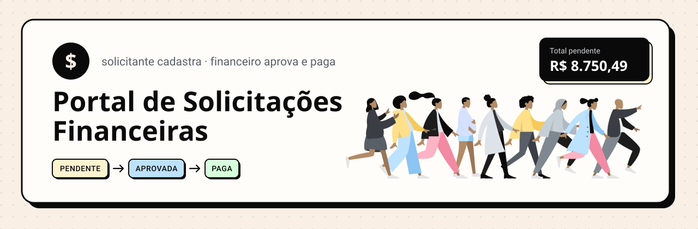
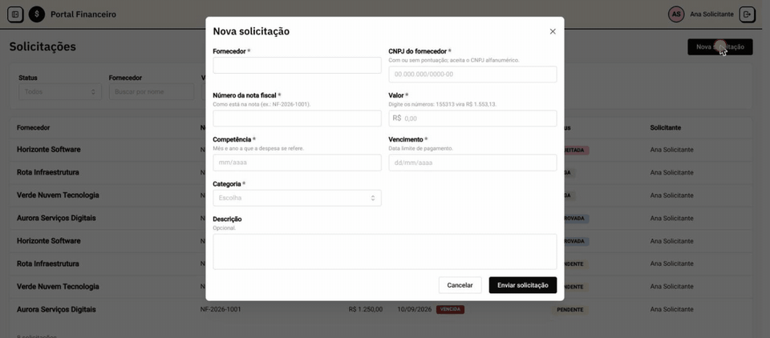
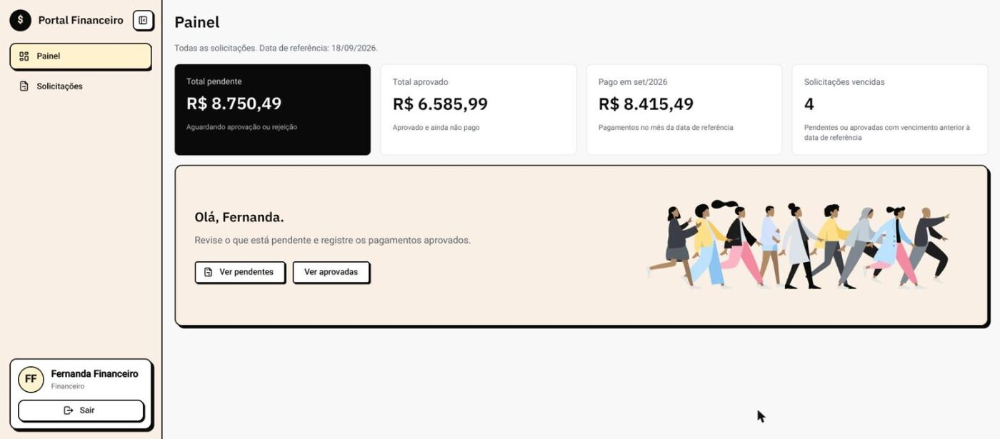
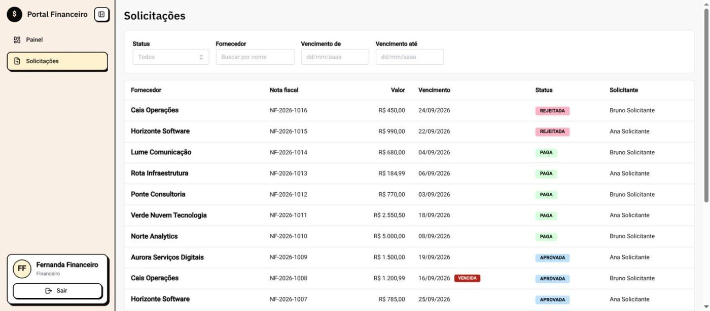
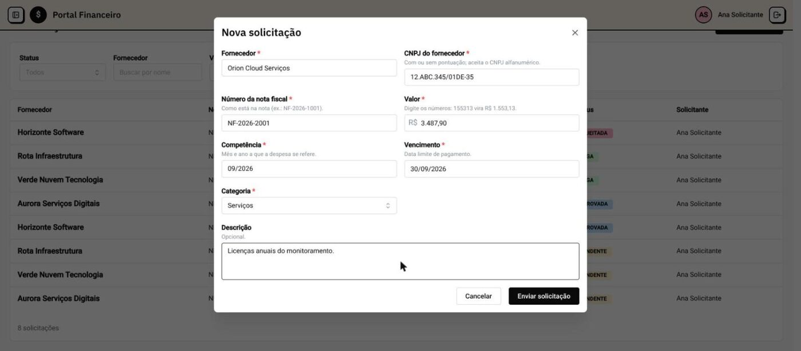
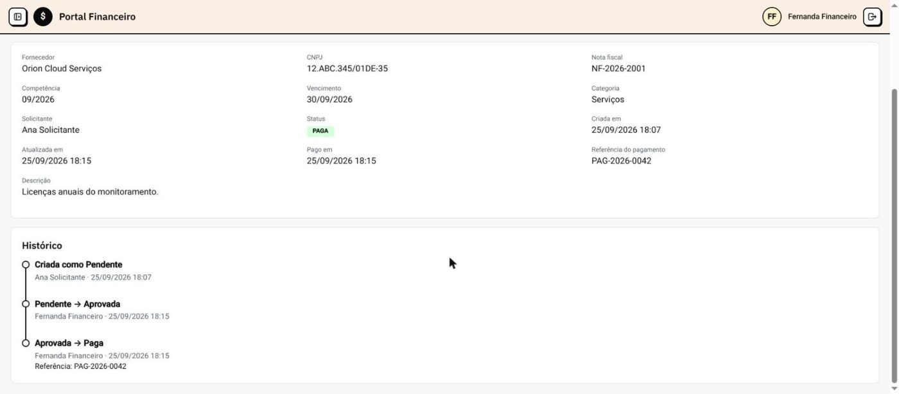

<div align="center">



     

A pessoa solicitante cadastra uma despesa; o financeiro aprova ou rejeita e registra o pagamento.<br>
TypeScript de ponta a ponta: React (Vite + Mantine) no front, Node (Fastify) na API, PostgreSQL no banco.



</div>

| Painel do financeiro | Lista com filtros |
| --- | --- |
|  |  |
| **Nova solicitação (solicitante)** | **Detalhe com histórico** |
|  |  |

<details>
<summary>Tela de login</summary>


</details>

## Rodar

```bash
docker compose up --build
```

| O quê | Onde |
| --- | --- |
| Aplicação | http://localhost:3000 |
| API (Swagger) | http://localhost:3000/api/docs |

Na subida, a API aplica as migrations e carrega o seed (idempotente) antes de aceitar requisições. Nenhum `.env` é
necessário: todas as variáveis têm valor padrão (veja `.env.example`).

| Perfil | E-mail | Senha |
| --- | --- | --- |
| Solicitante (Ana) | `solicitante@gex.test` | `GexRequester123!` |
| Solicitante (Bruno) | `outro.solicitante@gex.test` | `GexRequester456!` |
| Financeiro (Fernanda) | `financeiro@gex.test` | `GexFinance123!` |

> [!NOTE]
> O compose usa `APP_TODAY=2026-09-18` por padrão, então o painel do financeiro mostra os números esperados:
> R$ 8.750,49 pendente · R$ 6.585,99 aprovado · R$ 8.415,49 pago no mês · 4 vencidas.
> Para usar a data atual de São Paulo: `APP_TODAY= docker compose up --build`.

Voltar ao estado do seed (apaga os dados criados durante o uso):

```bash
docker compose down -v && docker compose up --build
```

## Testar

```bash
docker compose --profile test run --rm back-test    # API: unitários + integração no PostgreSQL real
docker compose --profile test run --rm front-test   # front: lógica e componentes
```

280 testes: 148 no back (116 unitários + 32 de integração) e 132 no front. O `back-test` usa um banco próprio
(`gex_finance_it`) e nunca toca nos dados do app. `make test` roda os dois (o `Makefile` só tem atalhos para esses
comandos, mais `make up` e `make reset`). Sem Docker: `npm test` em `front/`; em `back/`, `npm run test:unit` e
`npm run test:integration` (este precisa do Postgres do compose no ar).

Os testes obrigatórios do enunciado levam o número no nome (ex.: `#3 two simultaneous duplicate creations`). O mapa
completo está em [`docs/TESTING.md`](docs/TESTING.md).

## Como as regras críticas são garantidas

| Regra | Como |
| --- | --- |
| Dinheiro exato | centavos inteiros de ponta a ponta: `BIGINT CHECK (> 0)` no banco, `amount_cents` na API; o front converte `1.553,13` → `155313` por texto, sem float |
| Nota duplicada, inclusive em requisições simultâneas | `UNIQUE (supplier_cnpj, invoice_number)` no banco; a violação (`23505`) vira 409, sem registro extra |
| Transições seguras sob concorrência | `UPDATE … WHERE status = <esperado>` (compare-and-set) + evento de auditoria na mesma transação; quem perde a corrida recebe 409 |
| Histórico imutável | trigger no banco bloqueia `UPDATE`/`DELETE` em `audit_events` |
| Datas sem deslocamento de fuso | `DATE` trafega como texto `YYYY-MM-DD`; o "hoje" vem do servidor (`APP_TODAY` ou São Paulo) e o front não calcula vencimento |
| Autorização no backend | sessão opaca no Postgres (cookie `HttpOnly`, `SameSite=Strict`), papel lido do banco a cada requisição, header anti-CSRF, rate limit no login |
| Headers de segurança | CSP restrita à própria origem, `nosniff`, `X-Frame-Options: DENY`, `Referrer-Policy`, `Cache-Control: no-store` na API |
| Nada sensível em log | log com campos fixos; erro de banco reduzido a `{ name, code }` |

## Desvios conscientes

1. **CNPJ alfanumérico.** O enunciado fala em "14 dígitos". Guardamos as 14 posições sem máscara e aceitamos também o
   formato alfanumérico que a Receita Federal emite desde julho de 2026; os CNPJs numéricos se comportam exatamente
   como pedido. §11.
2. **`APP_TODAY` com padrão no compose**, para a avaliação ser reproduzível já no primeiro `up`. §9.4.1.
3. **`JWT_SECRET` sem uso:** a autenticação é por sessão opaca no banco, que permite logout de verdade. §8.1.
4. **`APP_TIMEZONE` ignorado:** o fuso é fixo em `America/Sao_Paulo`, como o enunciado exige.
5. **Rotas sob `/api`** (`/api/auth/login`, `/api/requests`…), para front e API ficarem na mesma origem.
6. **401 sem `WWW-Authenticate`:** não existe esquema HTTP padrão para sessão por cookie. §5.3.

Os § apontam para [`docs/decisoes/DECISOES_FUNDACAO.md`](docs/decisoes/DECISOES_FUNDACAO.md).

## Documentação

| Documento | Conteúdo |
| --- | --- |
| [`ARCHITECTURE.md`](ARCHITECTURE.md) | camadas, concorrência, modelo de dados, fuso e front, com diagramas |
| [`SECURITY.md`](SECURITY.md) | controles de segurança, headers, política de log e limitações conhecidas |
| [`docs/TESTING.md`](docs/TESTING.md) | estratégia de testes e onde está cada teste obrigatório do enunciado |
| [`docs/API.md`](docs/API.md) | convenções da API e o fluxo completo com `curl` |
| [`docs/decisoes/`](docs/decisoes/) | as 17 decisões de arquitetura, com alternativas, motivos e fontes |

## Estrutura

```
back/     API: handler (HTTP) → service (regras) → repository (PostgreSQL, SQL em arquivo com PgTyped)
front/    React: telas em features/, tipos da API gerados do OpenAPI do back
data/     dados do desafio (montados só para leitura no seed)
docs/     decisões de arquitetura, testes e API
```

## Licença e créditos

Todos os direitos reservados. O código está disponível sob uma [licença de avaliação](LICENSE): uso permitido somente
para avaliar a candidatura no processo seletivo, sem uso em produção, redistribuição ou obra derivada.

Material de terceiros, cada um sob a própria licença:

- Paleta e tipografia inspiradas em [EasyPay: E-Wallet Digital Payment App](https://www.figma.com/community/file/1146678238901785717/easypay-e-wallet-digital-payment-app),
  de Nickelfox (Figma Community, CC BY 4.0).
- Ilustrações [Open Doodles](https://www.opendoodles.com) e [Humaaans](https://www.humaaans.com), de Pablo Stanley (CC0).
- Fontes IBM Plex Sans e Roboto (SIL Open Font License 1.1).
- `data/`: dados do desafio, reproduzidos sem alteração.
